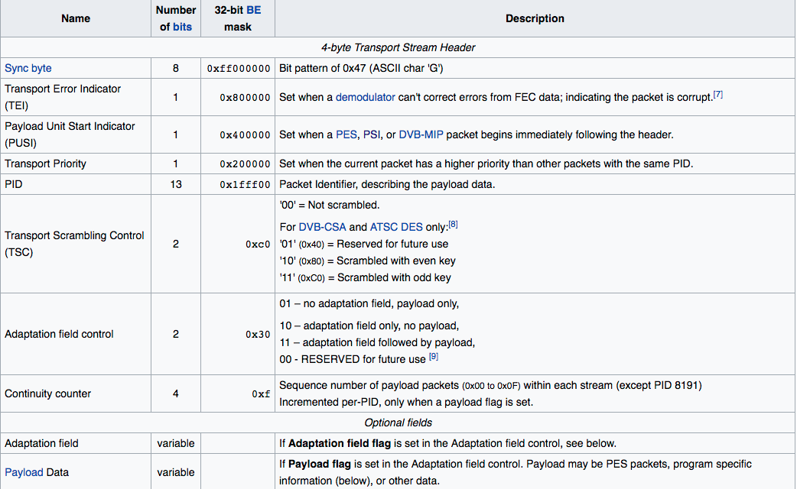
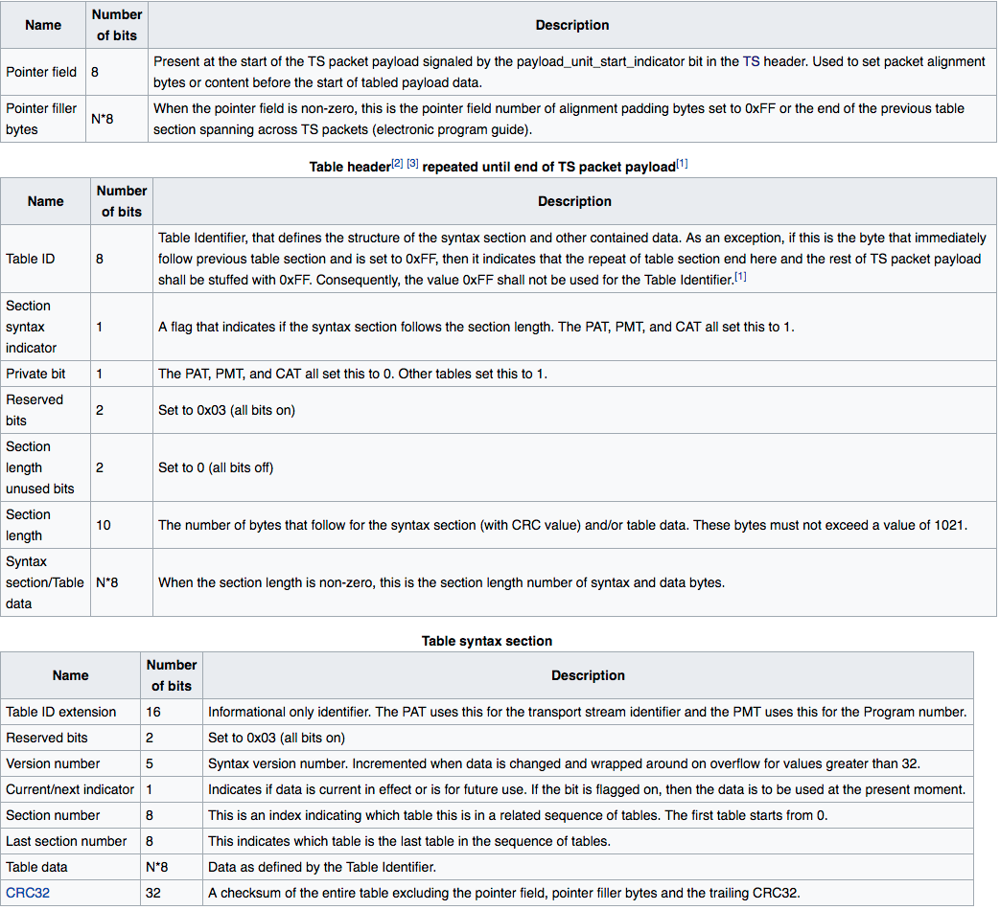
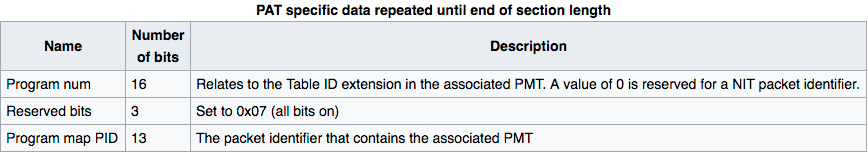
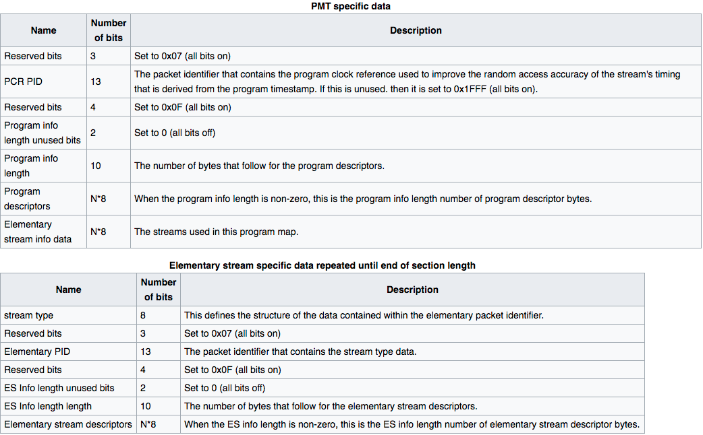
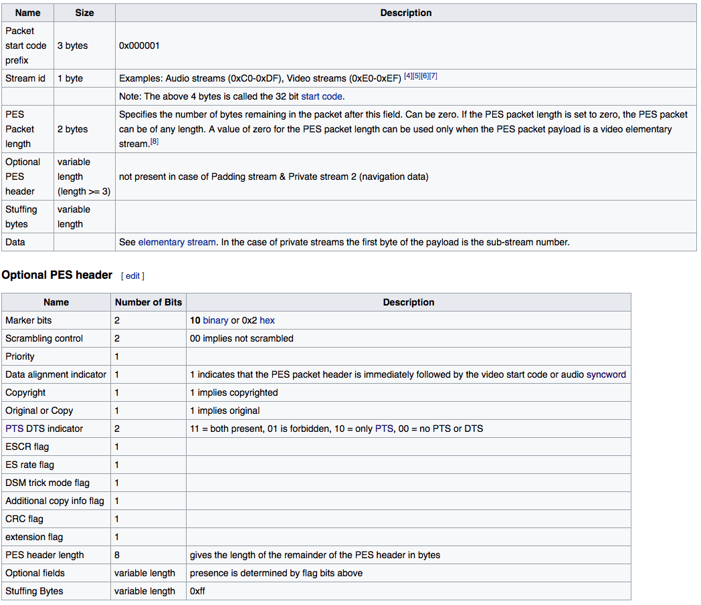

# MPEGTS, the lowdown

- [Types of MPEG-2](#types-of-mpeg-2)
  - [Program Streams](#program-streams)
  - [Transport Streams](#transport-streams)
- [Why are we looking at this?](#why-are-we-looking-at-this)
  - [HLS uses it](#hls-uses-it)
- [MPEG-2 Transport Stream Specifics](#mpeg-2-transport-stream-specifics)
  - [What makes up a transport stream?](#what-makes-up-a-transport-stream)
    - [The Header](#the-header)
      - [Sync byte ](#sync-byte-)
      - [Packet Identifiers (PID)](#packet-identifiers-pid)
      - [Payload Unit Start Indicator (PUSI)](#payload-unit-start-indicator-pusi)
      - [Continuity Counter](#continuity-counter)
    - [The Payload](#the-payload)
      - [Program Specific Information (PSI)](#program-specific-information-psi)
        - [Program Association Table (PAT)](#program-association-table-pat)
        - [Program Map Table (PMT)](#program-map-table-pmt)
      - [Packetized Elementary Stream (PES)](#packetized-elementary-stream-pes)
- [Tools](#tools)
- [Glossary](#glossary)
- [References](#references)

## Types of MPEG-2

### Program Streams

A program stream is a container format meant to be used for DVD-Video / HD-DVD discs where everything is easily accessible on the medium, and the network isn’t involved, therefore the format makes use of the reliable storage and access, and uses a global header, and can then not need to repeat it.

### Transport Streams

A transport stream is used for transmission of multiplexed and packetized elementary streams. It includes error correction and stream synchronization in case of lost network traffic. In contrast to the program stream format, it can include multiple programs, so for example it could contain multiple TV channels in the same transport stream, that could be demuxed by the receiver.

## Why are we looking at this?

### HLS uses it

The HLS specification defines the usage of MPEGTS or fragmented MP4 delivery.

* [MPEG-2 Transport Streams](https://tools.ietf.org/html/draft-pantos-http-live-streaming-23#section-3.2)

* [Fragmented MPEG-4](https://tools.ietf.org/html/draft-pantos-http-live-streaming-23#section-3.3)

The HLS specification defines a few things about how the TS segment should:

* Only have a single program. These type of Transport streams are referred to as SPTS or Single Program Transport Stream

* The first two packets in each segment should contain the Program Association Table (PAT) and Program Map Table (PMT).

    * Therefore the first or second packet in the transport stream should contain the Program Specific Information section. Which means the Payload Unit Start Indicator (PUSI) flag should be set on the first packet.

    * You can use a EXT-X-MAP tag to identify where the PAT and PMT can be found for MPEGTS content if it is available outside the segment.

        * **Perhaps we could reduce the overhead of our segments metadata this way by reducing the duplication of this data. (INGEST)**

There is also a tag in HLS called *#EXT-X-INDEPENDANT-SEGMENTS. *This tag asserts that all segments can be decoded and played independently of each other.

In order to guarantee the above assertion, you need to make sure that the segment only refers to data frames that are included inside the segment. The (only?) method to do this is to ensure that every segment begins with a IDR frame.

What is an IDR frame?

"An encoder sends an IDR (Instantaneous Decoder Refresh) coded picture (made up of I- or SI-slices) to clear the contents of the reference picture buffer. On receiving an IDR coded picture, the decoder marks all pictures in the reference buffer as ‘unused for reference’. All subsequent transmitted slices can be decoded without reference to any frame decoded prior to the IDR picture. The first picture in a coded video sequence is always an IDR picture." 

- Iain E. G. Richardson’s [H.264 and MPEG-4 Video Compression](http://www.amazon.com/H-264-MPEG-4-Video-Compression-Generation/dp/0470848375/ref=sr_1_2?s=books&ie=UTF8&qid=1325020249&sr=1-2)

*What are I B P frames?*

IDR frames are a sub-classification of I frames. All IDR frames are I frames, not all I frames are IDR frames.

## MPEG-2 Transport Stream Specifics

### What makes up a transport stream?

Packets make up a transport stream. It’s packets all the way down. 

There is no global file header like many other file types (including program streams!), instead, each packet has a header. The structure of the header of a packet is very well defined. It takes up exactly 4-bytes.

#### The Header

The table above shows the format that the header takes, including the number of bits from the bytes that are included. Many of the values are particular bits in one of the four bytes, so you need to bitmask, which is why the 32-bit bitmask is provided.

##### Sync byte 

The sync byte is actually a full byte! It’s the only one, and it was purposeful. It’s intended purpose is to make seeking and finding the start of TS packets easy. You simply read the file until you find that byte, and then you can parse the following bytes, which allows you to "make the call" if it’s a TS packet, and then look for the next sync byte to find the start of the next packet.

##### Packet Identifiers (PID)

Packet identifiers, or PID for short, are used to identify packets that are related to the same "packetized" data. Some PIDs are reserved, this is intended so that you know what PID to look for specific pieces of data such as the Program Specific Information* *tables.

##### Payload Unit Start Indicator (PUSI)

Payload Unit Start Indicator or PUSI for short, will be set to true when specific payloads are starting. For example, when the PSI is in the payload, this flag will be set to 1. Another important example is PES packets (Packetized Elementary Stream).

##### Continuity Counter

An increasing number per PID, incremented when the payload flag is set in the Adaptation Field Control bits. Can be used to order the packets before passing to decoder and identify gaps. (What do you do when there is one? confirm?!)

When a file is being encoded, you can identify what PID should be used if your downstream system cares. We identify the PID currently in the analyzer tool by the "stream_type" value that is associated so we can detect what PID was used by FFmpeg out of the reserved set.

#### The Payload

##### Program Specific Information (PSI)

Program Specific Information or PSI, is a collection of "tables". Each table begins with a header, which is defined below, and these are included in the payload of a packet. The PSI tables are one type of packet that can trigger the Payload Unit Start Indicator to be set. Similar to the header of the packet the table is a well-defined structure.

###### Program Association Table (PAT)

The table data for the PAT essentially gives you a map of what PIDs are part of what programs. This table will always be referenced as PID 0x0000, and table id 0x00. As noted above in the diagram, all the tables end with a checksum, so you can always guarantee that the data came over the wire correctly. This is part of the error detection properties of MPEGTS.

With HLS as we are dealing with single program streams, the benefit of this table is it gives us a list of the PIDs we can expect when processing the rest of the stream.

###### Program Map Table (PMT)

The Program Map Table or PMT describes the contents of each PID, so combined with the Program Association Table, you can produce the expected content of the stream of data, and if we were in a multi-program environment, of that particular program.

Inside the PMT is a PID reference for the Program Clock Reference (PCR), which is what the decoder can use to synchronize the playback of the multiple streams. The packet identified by this PID will contain a timestamp in the adaptation field of that packet, this timestamp can be used to generate a clock in the decoder. The Presentation timestamps are relative to this value.

Another concept that is introduced here is the Elementary Stream (ES), this is finally, the ACTUAL data that you are trying to deliver. The rest of what has been described so far is the mechanism to get it to the end-user, and able to be reassembled into something for playback!

The elementary stream type is an 8-bit value, so there are a possible 256 values, many of which are [well defined](https://en.wikipedia.org/wiki/Program-specific_information#Elementary_stream_types). There are a few sections that are privately defined, and many are reserved.

Some examples values for stream types are:

* 27 == H.264

* 15 == AAC audio

Also inside the PMT are additional "[descriptors](https://en.wikipedia.org/wiki/Program-specific_information#Program_Element_Descriptor_Tags)", some things of interest are part of this, but many are defined as optional and many decoders don’t use the data included as the DVB standard says that many values should be ignored.

##### Packetized Elementary Stream (PES)

The payload of a TS packet can be a PES packet. It begins with a start code to identify them easily when parsing payloads, and a stream id which identifies the type of data that is being delivered.

In the world of MPEGTS this is where things start to become very individualized to the type of data that is being transferred.

There is one more [header](https://en.wikipedia.org/wiki/Elementary_stream), that leads the actual Data section of the stream, which contains resolution, frame rate, bitrate, and some encoder settings, but as of right now, this is one layer deeper than we need to go right now. But like it was mentioned earlier, it’s packets all the way down. With that, that’s essentially everything you need to know about the MPEGTS format, and some you don’t, but… your mileage may vary. 

## Tools

TSTools: [https://github.com/kynesim/tstools](https://github.com/kynesim/tstools) 

* Written in C, pretty strict on its handling of files, file MUST begin with a sync byte, otherwise it won’t parse or operate on the various CLI tools that are part of this repository.

* Mac users: [https://github.com/stuarthicks/tstools](https://github.com/stuarthicks/tstools) fork that builds, at the time only included changes are to use cmake over make, includes a brew cask

gots: [https://github.com/Comcast/gots](https://github.com/Comcast/gots)

* Written in Go

* Components to handle various parts of parsing MPEGTS, but very few "helper" functions, you really need to understand what you’re doing

## Glossary

Multiplexing - Combining many data streams into one.

Demuxing - Separating data streams into their individual components.

PES - [Packetized Elementary Streams](https://en.wikipedia.org/wiki/Packetized_elementary_stream) - This is the video / audio / subtitles data in MPEGTS.

PTS - [Presentation Timestamp](https://en.wikipedia.org/wiki/Presentation_timestamp) - This is used for the decoder to determine when to "play" it

HLS - HTTP Live Streaming - A format created by Apple for adaptive playback. Changes which rendition is playing based on the available bandwidth.

## References

[https://en.wikipedia.org/wiki/MPEG_transport_stream](https://en.wikipedia.org/wiki/MPEG_transport_stream)

[https://en.wikipedia.org/wiki/Program-specific_information](https://en.wikipedia.org/wiki/Program-specific_information)

