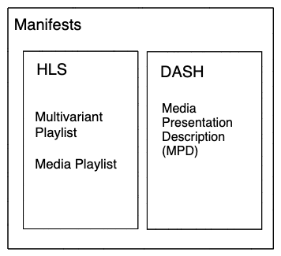

# Video Concepts Overview

- [Video Concepts Overview](#video-concepts-overview)
  - [Video Terms](#video-terms)
  - [Video File Format Breakdown](#video-file-format-breakdown)
  - [Video Streaming Options](#video-streaming-options)
    - [Progressive](#progressive)
    - [RTMP Streaming](#rtmp-streaming)
    - [HTTP Adaptive Bitrate Streaming](#http-adaptive-bitrate-streaming)
  - [HLS Specifics](#hls-specifics)
    - [Compatibility](#compatibility)
  - [Extra Streaming Concepts](#extra-streaming-concepts)
  - [Digital Rights Management (DRM)](#digital-rights-management-drm)
  - [MPEG Transport Stream deep-dive](#mpeg-transport-stream-deep-dive)
  - [Related Tech / Broadcasting Terminology](#related-tech--broadcasting-terminology)
  - [References](#references)

Below you will see `media content` used as a short-hand for this document to mean audio, video, and/or metadata tracks of data, representing what would be normally called... a video.

## Video Terms

- **Hardware Encoder**: computer with specialized hardware intended for the production of media content.
- **Software Encoder**: runs on general commodity hardware and can produce media content albiet generally at a frame-per-second speed slower than a hardware encoder.
- **Codecs**: short for coder-decoder, technologies which enables smaller file sizes for media content (audio and video). Examples: H.264, AAC-LC, Opus, VP9, H.265, AV1.
- **Segment / Chunk**: an interchangeable term used to define the pieces of _segmented_ media content.
- **Muxing**: Taking audio and video streams and putting them together into a container that when played will be able to synchronize their playback.
- **Demuxing**: Splitting a container into its seperate constituent parts.
- **Remux**: Move audio and video from one container format to another. This process is lossless with respect to the quality of the media content. However, sometimes the same information isn't present or required in one format or another and assumptions are made that may result in odd playback. Parts (audio, video, subtitles, etc) may be added/removed from the container as well during this process.
- **Transcode**: Process existing media content with new encoding settings. This process is lossy unlike remuxing. A different codec entirely, different codec settings, filters, etc...
- **Manifest**: a formalized structure for describing a playlist of media. Some types of manifests include more metadata about the media and support different features.
- **Packager**: software which will take an encoded peice of media content and "package" it into a container or manifest format.
- **Media Source Extensions (MSE)**: a collection of Browser APIs which enable a developer to add support for alternative methods of delivery of media to the browsers.

## Video File Format Breakdown

Container - define a structured file format for containing video, audio, and metadata tracks for media.

The most popular container formats we work with are part of MPEG-2, and ISOBMFF standards.
* MPEG-2 Transport Streams (.ts)
* ISO Base Media File Format (.mp4)

---

## Video Streaming Options

### Progressive

* Single video file hosted on web server available via HTTP.
* Player downloads file from web server and handles playback.
* Having the `moov` atom at the beginning of a video allows web browsers to perform fast-seeking on progressively served files. The HTTP server also must support HTTP Range requests. FFmpeg related flag: `-movflags faststart`.

Pros
* Simple, broad compatibility

Cons
* Wasted data for content transferred but not watched (if moov is at back of file)
* Single video quality (bitrate), not ideal for many real-world network conditions
* No live streaming capability

### RTMP Streaming

Protocol for streaming video in chunks and variable qualities developed by Macromedia / Adobe. It has many variations for different use-cases. RTMP(S|E|T|P). Largely has been superseded by HTTP-based streaming technologies due to content delivery network support and ubiquity of HTTP-based delivery.

Notable exception to this rule: HQ Trivia used RTMP to stream their media.

### HTTP Adaptive Bitrate Streaming

* Encodes source video to multiple different bitrates referred to as renditions
* Each rendition is segmented into small video 'segments' which range in duration based on requirements, but are generally between 6-10 seconds in duration.
* Standards: HLS, MPEG-DASH, MS Smooth Streaming...

Pros:
* Player will select best bitrate for the current network speed and can switch bitrates on the fly
* Builds buffer as-needed instead of continuously
* Use of HTTP for data transfer means cheaper hosting and far fewer firewall issues
* No state management on server-side - adaptation logic is done client-side

Cons:
* Compatibility/Support

Example playback engines that support these styles of content are below.

- [Shaka Player Demo](https://shaka-player-demo.appspot.com/demo/)
- [HLS.js Demo](https://hls-js.netlify.app/demo/)
- [DASH.js Demo](https://reference.dashif.org/dash.js/v4.3.0/samples/dash-if-reference-player/index.html)
- [Video.js Plugin](https://github.com/videojs/http-streaming)

---

## HLS Specifics

* Multivariant playlist includes URLs for bandwidth-specific Media Playlist files (aka rendition / variant)
* Media Playlists contain the location of the video segments.
* Video segments are in the .ts container format, or fragmented MP4, or more specifically sometimes CMAF.
* Multivariant playlist can also include various metadata and extra content such as Media Playlists for subtitles, I-frame playlists, and more. This is mainly where the HLS version comes into play.
* Video files may be encrypted at rest and decryption keys can be provided in the playlists for the player to handle decryption
* Multiple Media Playlists can be generated for a single video and the client-side application can choose to play any one variant. You sometimes hear "bitrate ladder" to describe the set of variants that will be created at various qualities.

HLS feature overview: <https://developer.apple.com/library/content/referencelibrary/GettingStarted/AboutHTTPLiveStreaming/about/about.html>

Example Playlist features: <https://developer.apple.com/library/content/technotes/tn2288/_index.html>

### Compatibility

Many devices/browsers don't support HLS natively:

Media Source Extensions (MSE) API can allow HLS format to be played in-browser and has broader support:

MSE allows JS scripts to take in the raw video data and re-mux it to a video container format that is supported by the current browser.

There are multiple projects on the web that have come up that support the remux from MPEG-TS -> ISOBMFF, the container format supported by MSE.
- The project [HLS.js](https://github.com/video-dev/hls.js) handles this conversion internally.
- The project [Shaka Player](https://github.com/shaka-project/shaka-player) handles this conversion using a library component [mux.js](https://github.com/videojs/mux.js).
- The project [Video.js](https://github.com/videojs/video.js) handles this conversion using a library component [mux.js](https://github.com/videojs/mux.js).

---

## Extra Streaming Concepts

* Client Side Ad Insertion (CSAI):
  * Ads are inserted on the client-side and determined just-in-time when an opportunity is detected. Ad playback will require that content be stopped/interrupted, or be paused if using a two-player solution.
  * A two-player solution is that where a video player may internally have two seperate rendering canvases that it controls - one for content, one for ads.
* Server Side Ad Insertion (SSAI):
  * AKA Stitched ads, dynamic ad insertion
  * Ads are not encoded into the video but are inserted later (often at manifest request-time) into the HLS playlists (uses HLS discontinuity tag to indicate separate content)
  * Allows for ads to be chosen based on current inventory and possibly targeted based on current user data
* DAI (Dynamic Ad Insertion):
  * A conceptual term, which can be utilized with both CSAI and SSAI strategies. In general this means that there is the ability to specify/request variable amount of ad breaks ("opportunities") which can be filled.
  * One example of when this is useful is for linear TV streams that may have outdated commericals within. It would be ideal to be able to dynamically insert new, fresh ads well after the original broadcasting date.
* VAST, VPAID, VMAP
  * Video advertising format standards developed by the IAB (Interactive Advertising Bureau)
* Encrypted Media Extensions (EME)
  * Browser API allowing implementation of DRM (Digital Rights Management)
  
## Digital Rights Management (DRM)

* DRM Varieties
  * Google Widevine
    * There are two versions of Widevine, Classic - available only via a downloadable player. The other is Modular - works with HTML5 in Google Chrome and Android devices. Classic has been deprecated.
  * Microsoft PlayReady
    * Supported on Internet Explorer, Microsoft Edge, XBOX and many other Smart TVs and OTT devices.
  * Apple FairPlay Streaming (FPS)
    * Apple's DRM solution for HTTP Live Streaming (HLS) - it works on iOS, Apple TV, Safari on macOS.

---

## MPEG Transport Stream deep-dive

See [here](./MPEGTS%20Knowledge.md).

---

## Related Tech / Broadcasting Terminology

* TV Everywhere (TVE) Authentication
  * Require a TV subscription to view video
  * Authentication (Auth-N): The user has a valid account with TV providers. TV providers are AKA as:
    * (US) MVPD - Multichannel video programming distributor
    * (CAN) BDU - Broadcast Distribution Undertaking
  * Authorization (Auth-Z): The user's TV subscription has access to a given channel.
  * Adobe Pass (aka Primetime authentication) is the main provider of TVE services, acting as the middleman between video apps and hundreds of MVPDs
* SVOD (Subscription Video On Demand)
  - Subscription-based video streaming where the user has a set subscription plan and has access to VOD until that subscription has ended (e.g. Netflix)
* TVOD (Transactional Video On Demand)
  - Transactional-based video streaming is where a single transaction can gain the user access to specific content.
  - More often, the service will be free to sign up for but content will require payment (e.g. iTunes)
* AVOD (Advertisement-based Video On Demand)
  - The VOD service is free to use and consume as it is supported by advertisment revenue (e.g. YouTube)

---

## References

* HLS overview: <https://developer.apple.com/library/content/referencelibrary/GettingStarted/AboutHTTPLiveStreaming/about/about.html>
* Example HLS Playlists: <https://developer.apple.com/library/content/technotes/tn2288/_index.html>
* MSE API Docs: <https://developer.mozilla.org/en-US/docs/Web/API/Media_Source_Extensions_API>
* hls.js: <https://github.com/video-dev/hls.js/tree/master>
* Adobe Pass Docs: <https://tve.helpdocsonline.com/home>
* Adaptive bitrate streaming overview: <https://en.wikipedia.org/wiki/Adaptive_bitrate_streaming>
* Video Container Details: <https://en.wikipedia.org/wiki/Comparison_of_video_container_formats>
* SVOD, TVOD, AVOD: https://clipbucket.com/2019/03/07/understanding-the-terms-svod-avod-tvod-and-the-difference-between-vod-and-ott/
* What is DRM?: https://www.streamingmedia.com/Articles/Editorial/What-Is-/What-Is-DRM-112279.aspx
* DAI, CSAI, SSAI: https://www.headendinfo.com/csai-ssai/
