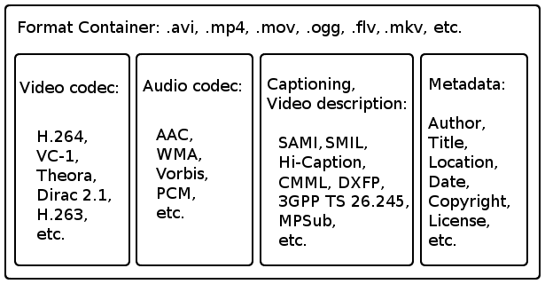
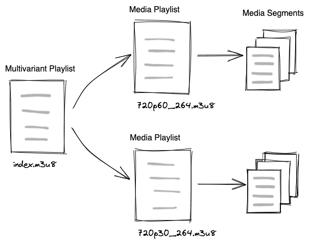
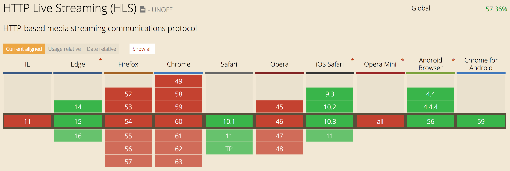
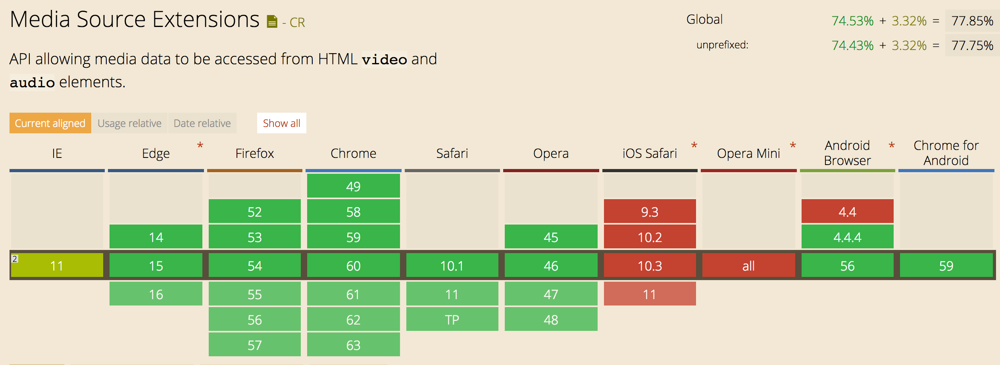

# Video Concepts Overview

- [Video Concepts Overview](#video-concepts-overview)
  - [Video Terms](#video-terms)
  - [Video File Format Breakdown](#video-file-format-breakdown)
  - [Video Streaming Tech](#video-streaming-tech)
    - [Progressive](#progressive)
    - [RTMP Streaming](#rtmp-streaming)
    - [HTTP Adaptive Bitrate Streaming](#http-adaptive-bitrate-streaming)
  - [HLS Specifics](#hls-specifics)
    - [Compatibility](#compatibility)
  - [Extra Streaming Concepts](#extra-streaming-concepts)
  - [Related Tech](#related-tech)
  - [References](#references)

Below you will see `media content` used as a short-hand for this document to mean audio, video, and/or metadata tracks of data, representing what would be normally called... a video.

## Video Terms

- **Hardware Encoder**: computer with specialized hardware intended for the production of media content.
- **Software Encoder**: runs on general commodity hardware and can produce media content albiet generally at a frame-per-second speed slower than a hardware encoder.
- **Codecs**: short for coder-decoder, technologies which enables smaller file sizes for media content (audio and video). Examples: H.264, AAC-LC, Opus, VP9, H.265, AV1.
- **Segment / Chunk**: an interchangeable term used to define the pieces of _segmented_ media content.
- **Muxing**: Taking audio and video streams and putting them together into a container that when played will be able to synchronize their playback.
- **Demuxing**: Splitting a container into its seperate constituent parts.
- **Remux**: Move audio and video from one container format to another. This process is lossless with respect to the quality of the media content. However, sometimes the same information isn't present or required in one format or another and assumptions are made that may result in odd playback. Parts (audio, video, subtitles, etc) may be added/removed from the container as well during this process.
- **Transcode**: Process existing media content with new encoding settings. This process is lossy unlike remuxing. A different codec entirely, different codec settings, filters, etc...
- **Manifest**: a formalized structure for describing a playlist of media. Some types of manifests include more metadata about the media and support different features.
- **Packager**: software which will take an encoded peice of media content and "package" it into a container or manifest format.
- **Media Source Extensions (MSE)**: a collection of Browser APIs which enable a developer to add support for alternative methods of delivery of media to the browsers.

## Video File Format Breakdown

Container - define a structured file format for containing video, audio, and metadata tracks for media.

The most popular container formats we work with are part of MPEG-2, and MPEG-4 standards.
* MPEG-2 Transport Streams (.ts)
* MPEG-4 Part 14 (.mp4)

---

## Video Streaming Tech

### Progressive

* Single video file hosted on server
* Player downloads entire file

Pros
* Simple, broad compatibility

Cons
* Wasted data for content transferred but not watched
* Single video quality (bitrate), not ideal for many real-world network conditions
* No live streaming capability

### RTMP Streaming

Custom protocol for streaming video in chunks and variable qualities.
Superseded by HTTP-based streaming technologies

### HTTP Adaptive Bitrate Streaming

* Encodes source video to multiple different bitrates referred to as renditions
* Each rendition is segmented into small video 'segments' which range in duration based on requirements, but are generally between 6-10 seconds in duration.
* Standards: HLS, MPEG-DASH, MS Smooth Streaming...

Pros:
* Player will select best bitrate for the current network speed and can switch bitrates on the fly
* Builds buffer as-needed instead of continuously
* Use of HTTP for data transfer means cheaper hosting and far fewer firewall issues
* No state management on server-side - adaptation logic is done client-side

Cons:
* Compatibility/Support

[Example ABS player (HLS, DASH, MSS) with bitrate graphs/stats](http://orange-opensource.github.io/hasplayer.js/1.11.0/samples/Dash-IF/index.html)

---

## HLS Specifics

* Master playlist (.m3u8, aka manifest) includes URLs for bandwidth-specific playlist (.m3u8) files (aka rendition)
* Playlists for each rendition has URLs for video segments
* Video segments are in the .ts (transport stream) container format (newer versions also support mp4)
* Master playlist can also include various metadata and extra content such as subtitle streams/file, I-frame playlists, and more (what's possible depends on HLS version supported)
* Video files may be encrypted at rest and decryption keys can be provided in the playlists for the player to handle decryption
* Multiple master playlists can be generated (aka variants) for a single video and the client-side application can choose to play any one variant. This is often done to make different renditions available to different devices e.g. a mobile variant may contain lower minimum bandwidth renditions as compared to a variant meant for console.

HLS feature overview: <https://developer.apple.com/library/content/referencelibrary/GettingStarted/AboutHTTPLiveStreaming/about/about.html>

Example Playlist features: <https://developer.apple.com/library/content/technotes/tn2288/_index.html>

### Compatibility

Many devices/browsers don't support HLS natively:

Media Source Extensions (MSE) API can allow HLS format to be played in-browser and has broader support:

MSE allows JS scripts to take in the raw video data and re-mux it to a video container format that is supported by the current browser.
The project [HLS.js](https://github.com/video-dev/hls.js) handles this conversion via MSE and we can build video players on top of it supporting HLS playback on all major browsers.

---

## Extra Streaming Concepts

* Server Side Ad Insertion (SSAI):
  * AKA Stitched ads, dynamic ad insertion
  * Ads are not encoded into the video but are inserted later (often at manifest request-time) into the HLS playlists (uses HLS discontinuity tag to indicate separate content)
  * Allows for ads to be chosen based on current inventory and possibly targeted based on current user data
* VAST, VPAID, VMAP
  * Video advertising format standards developed by the IAB (Interactive Advertising Bureau)
  * We'll all be learning more about this
* Encrypted Media Extensions (EME)
  * Browser API allowing implementation of DRM (Digital Rights Management)

---

## Related Tech

* TV Everywhere (TVE) Authentication
  * Require a TV subscription to view video
  * Authentication (Auth-N): The user has a valid account with TV providers. TV providers are AKA as:
    * (US) MVPD - Multichannel video programming distributor
    * (CAN) BDU - Broadcast Distribution Undertaking
  * Authorization (Auth-Z): The user's TV subscription has access to a given channel.
  * Adobe Pass (aka Primetime authentication) is the main provider of TVE services, acting as the middleman between video apps and hundreds of MVPDs
  * Draw diagram

---

## References

* HLS overview: <https://developer.apple.com/library/content/referencelibrary/GettingStarted/AboutHTTPLiveStreaming/about/about.html>
* Example HLS Playlists: <https://developer.apple.com/library/content/technotes/tn2288/_index.html>
* MSE API Docs: <https://developer.mozilla.org/en-US/docs/Web/API/Media_Source_Extensions_API>
* hls.js: <https://github.com/video-dev/hls.js/tree/master>
* Adobe Pass Docs: <https://tve.helpdocsonline.com/home>
* Adaptive bitrate streaming overview: <https://en.wikipedia.org/wiki/Adaptive_bitrate_streaming>
* Video Container Details: <https://en.wikipedia.org/wiki/Comparison_of_video_container_formats>
